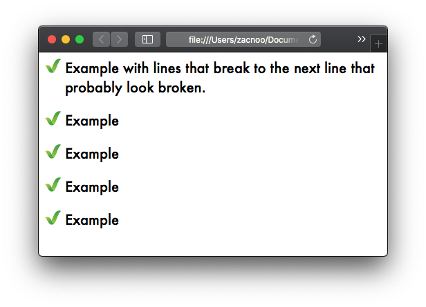
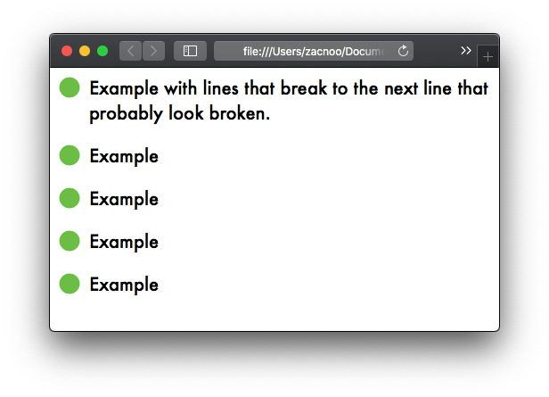
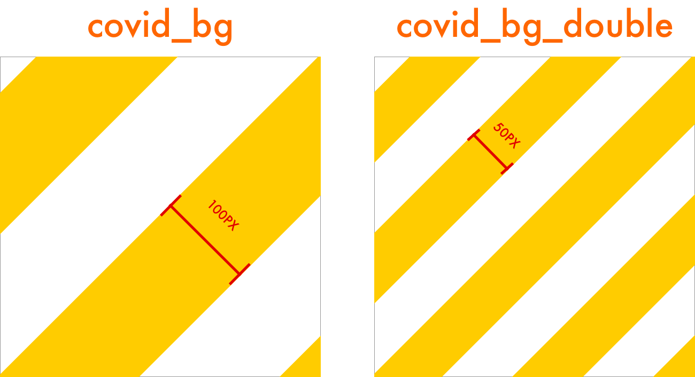

# Orange Dog Unified Divi Child Theme
### Overview:

This is a child theme for Divi, it adds some common theming to reduce the usage of the Divi custom CSS field, and reduce re-doing the same work multiple times.

### Instructions:
It is designed to be automatically deployed, but can be added by simply grabbing the source code .zip from releases and uploading to Wordpress as a theme.

## Classes:

Any CSS classes that add styling via style.css will be documented here.

****

### SafeSite Ticks

*.ss_ticks

Usage: Used on any parent element of a `<ul>` element. Doesn't matter how many DOM nodes away the parent is.

Example:

### SafeSite Bullet Points

*.ss_green_bullets*

Usage: Used on any parent element of an `<ul>` element. Doesn't matter how many DOM nodes away the parent is.

Example:

### COVID-19 Background

*.covid_bg*

*.covid_bg_double*

Usage: Used on background, loops endlessly.

Example:

## Functions:

Any functionality that is added to the theme via functions.php will be documented here.
